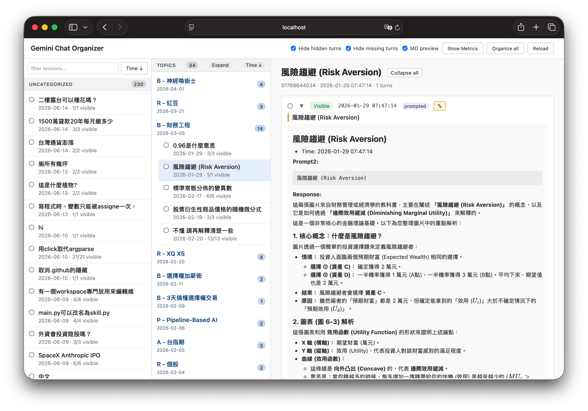

# Gemini Chat Organizer

Turn raw Gemini conversation history into clean, structured Markdown.

Gemini Chat Organizer downloads your Gemini chat history to your own disk, lets
you **hide/show individual turns** through a local web UI, group related
conversations into **Topics**, and then **export** polished Markdown documents.
The goal is to strip "procedural noise" (retries, error-correction back-and-forth)
while preserving a per-turn timestamp for every prompt so the line of thought
stays reconstructable.

Everything runs **locally** — your conversations never leave your machine.



The local web UI: a Session list on the left, your Topics in the middle, and the
selected Session's turns rendered as Markdown on the right — where you toggle each
turn Visible/Hidden before exporting.

---

## Features

- **Local-first backup** — your conversation history lives on your disk, not in the cloud.
- **Per-turn visibility** — toggle any prompt/response pair in or out with one click; the choice is saved immediately.
- **Topics** — group one or more conversation Sessions into a logical project and reorder them freely.
- **Timestamps preserved** — every turn keeps its original `YYYY-MM-DD HH:mm:ss` time.
- **Self-contained exports** — referenced images are copied next to the Markdown and links are rewritten, so exported folders are portable (great for Obsidian / any Markdown app).
- **Editable annotations** — add a `prompt2` note to a turn to clarify or retitle it without touching the original.

## How it works

The data model is a strict hierarchy: **Archive → Topic → Session → Turn**.
A *Turn* is one prompt + one response. Conversations are auto-segmented into
*Sessions* by time gaps, and you organize Sessions into *Topics*.

The pipeline is a series of folders under `data/`:

```
0-raw  →  1-sessions  →  2-turns_md  →  (UI: toggle + organize)  →  4-exports
(Takeout)  (parsed JSON)  (MD cache)                                (final .md)
                                         3-topics (your groupings)
```

For the full design and rules, see the spec:
[English](docs/GeminiChatOrganizer-RSDC.md) ·
[中文版](docs/GeminiChatOrganizer-RSDC-tw.md).

---

## Requirements

- **Python 3.9+**
- **Node.js 18+**
- Your Gemini history exported from **Google Takeout** (see below).

## Installation

```bash
git clone <your-repo-url> GeminiChatOrganizer
cd GeminiChatOrganizer

# 1. Python core — the UI expects the virtualenv at ./.venv
python3 -m venv .venv
.venv/bin/pip install -r requirements.txt

# 2. Node.js UI bridge
cd ui
npm install
cd ..
```

> The Node server launches Python from `./.venv/bin/python`, so the virtualenv
> must be created at the repository root as `.venv`.

## Getting your Gemini data

1. Go to [Google Takeout](https://takeout.google.com/).
2. Deselect everything, then select **My Activity**, and within it limit the
   data to **Gemini Apps** (formerly Bard). Choose **JSON** as the format.
3. Download and unzip the export. Inside you'll find the activity file plus any
   attached images/files.
4. Put each export into its own dated subfolder under `data/0-raw/`, named
   `Gemini Apps YYMMDD` (6-digit date), with the activity JSON and its
   attachments inside:

   ```
   data/0-raw/
   └── Gemini Apps 260627/
       ├── 我的活動.json        # the activity file
       ├── image-....jpg        # attachments referenced by the chats
       └── ...
   ```

> **Important:** the parser looks for the activity file named **`我的活動.json`**
> (the Traditional-Chinese Takeout filename, "My Activity"). If your Takeout was
> generated in another language (e.g. `MyActivity.json`), rename it to
> `我的活動.json`.
>
> You can keep multiple dated folders. The parser compares the **two most recent**
> `Gemini Apps YYMMDD` folders to detect new, edited, or removed turns
> incrementally.

## Configuration

Two YAML files control behavior:

### `config.yaml` — paths and parsing

```yaml
rawDir: "data/0-raw"
sessionsDir: "data/1-sessions"
turnsMdDir: "data/2-turns_md"
topicsDir: "data/3-topics"
exportsDir: "data/4-exports"      # ← change to your preferred output folder
sessionGapSeconds: 1800            # gap (sec) that starts a new Session
syncStrategy: "archive"            # archive = keep locally after source deletion; mirror = sync-delete
templatePath: "export_template.yaml"
```

Set `exportsDir` to wherever you want the final Markdown — for example a folder
inside an Obsidian vault. (Absolute paths are fine.)

### `export_template.yaml` — output formatting

Controls headers, filenames, and the per-turn Markdown layout, e.g.:

```yaml
turn_separator: "\n\n---\n\n"
filename_pattern: "{date}_{sid}_{slug}.md"     # per-Session filenames
topic_filename_pattern: "{date}_{slug}.md"     # per-Topic filenames
slug_max_chars: 40
turn_header: "## {{ prompt_preview }}\n- Time: {{ timestamp }}"
prompt_block: "**Prompt:**\n\n```\n{{ prompt }}\n```"
response_block: "**Response:**\n\n{{ response_md }}"
```

## Running the app

```bash
cd ui
npm start
```

Then open <http://localhost:3030> (set `PORT` to change it). On startup the
server pre-renders the Markdown cache, so the first launch after importing new
data may take a moment.

## Using the UI

1. **Browse** Sessions in the sidebar; click one to see its turns.
2. **Hide noise** — toggle individual turns Visible/Hidden. Changes save instantly.
3. **Edit a prompt** (optional) — use the ✎ button to add a `prompt2` note/title.
4. **Create Topics** — multi-select Sessions and assign them to a Topic; reorder Sessions within a Topic as you like.
5. **Organize (export):**
   - **Organize this Topic** (in a Topic's detail view) exports just that Topic.
   - **Organize all** (top bar) exports the entire Archive — every Topic and Session.

   During an export the UI locks to prevent data races, then reports how many
   files were written.

## Output

Exports are written under `exportsDir`:

```
<exportsDir>/
├── assets/      # images copied from your raw data, referenced by the .md files
├── sessions/    # one Markdown file per Session
└── topics/      # one Markdown file per Topic
```

Only turns you left **Visible** are included. Image links are rewritten to
`../assets/<name>`, so a `topics/` or `sessions/` folder is fully portable.

## Project structure

```
engine/    Python core: parser, topic manager, renderer, exporter, CLI
ui/        Node.js bridge (server.js) + browser front-end (public/)
data/      Working dataset (0-raw → 1-sessions → 2-turns_md → 3-topics → 4-exports)
docs/      RSDC specification (authoritative design doc, EN + 中文)
config.yaml, export_template.yaml   The two config files above
```

> Note: the `data/` folder is git-ignored — your conversations stay private and
> are never committed.

## Command line (advanced)

The Python core can be driven directly without the UI:

```bash
.venv/bin/python -m engine.cli parse   --config config.yaml   # raw → sessions (+ render)
.venv/bin/python -m engine.cli render  --config config.yaml   # sessions → MD cache
.venv/bin/python -m engine.cli export  --config config.yaml   # export everything
.venv/bin/python -m engine.cli export  --config config.yaml --topic-ids <topicId>
```

## Notes & limitations

- Tested workflow assumes Takeout's `我的活動.json` filename (see above).
- Gemini-generated images that have no file on disk (e.g. `image_agent_tag_*`)
  cannot be localized and are left as-is in the export.
- This is a personal, local tool — there is no authentication; run it on your
  own machine.
